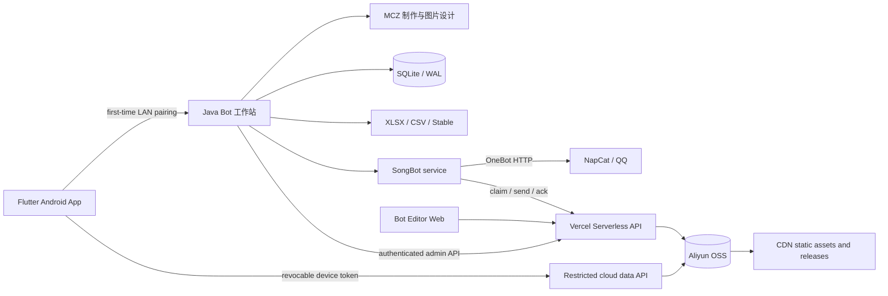

# Bot 工作站

一套面向音游社区运营的跨端机器人工作台。项目将 QQ 机器人、谱面制作、歌曲与 Stable 曲库、云公告、网站文章和移动管理整合到同一套系统中，同时保留原有高复杂度谱面参数和数据格式。

> 本仓库是经过脱敏的公开版本。真实管理员凭据、群号、数据库、公告附件、歌曲音频、受许可限制的模板和签名密钥均不在仓库中。

## 项目亮点

- **一站式桌面工作台**：在 Java 桌面端统一管理 SongBot、NapCat、谱面工具、曲库、Stable 数据与运营入口。
- **跨端管理**：Flutter Android App 首次在局域网用一次性配对码注册可撤销设备账户，之后直接通过受限云数据 API 跨网络查询和修改歌曲/Stable 元数据，不依赖电脑在线。
- **可靠数据写入**：SQLite WAL、CSV 与数据库双写、事务提交、写前备份、失败回滚、空数据防覆盖和非连续 ID 兼容。
- **低成本查询**：QQ群 `!ID/关键词` 查询始终命中本机 SQLite；CSV 只在启动时导入，不按消息请求云端资源。
- **云端公告链路**：Vercel Serverless API + 阿里云 OSS/CDN，支持附件、版本冲突检测、并发锁、任务认领、失败重试和审计记录。
- **纵深安全边界**：HttpOnly 管理员会话、HMAC 能力令牌、配对限速、请求体限制、路径校验与紧急写入阻断。
- **可发布交付**：Windows EXE/Setup、签名 Android APK、SHA-256 发布清单和启动前更新检查。

## 系统架构



更完整的数据流、并发模型和设计取舍见 [架构说明](docs/ARCHITECTURE.md)；权限边界见 [安全模型](docs/SECURITY_MODEL.md)。

## 仓库结构

| 目录 | 内容 |
| --- | --- |
| `mczmaker/` | 谱面录入、Combo/BPM、音频波形、封面与日历图设计 |
| `songbot/` | QQ 机器人、歌曲查询、Stable、公告执行与数据库服务 |
| `workstation/` | Java 桌面工作台、进程监管、管理员能力门与首次配对 API |
| `mobile/` | Flutter Android 管理端 |
| `web/` | Editor 前端、Vercel API、OSS 数据层与 Node 测试 |
| `docs/` | 功能矩阵、设计系统、架构和安全说明 |

## 技术栈

- Java 11、Swing、FlatLaf、Maven
- SQLite、Apache POI、JFreeChart
- Flutter / Dart、Android SDK
- Node.js 20、Vercel Serverless Functions
- 阿里云 OSS/CDN、NapCat / OneBot HTTP
- JUnit 5、Node Test Runner、Flutter Test、GitHub Actions

## 本地验证

### 1. Java 三模块

要求 JDK 21 和 Maven 3.9+；源码目标版本为 Java 11。

```bash
mvn -B -ntp clean verify
```

该命令会按 `mczmaker -> songbot -> workstation` 的依赖顺序编译，并执行 Catch 行块、公告版本、空数据保护、Unicode 附件名、Stable 事务和更新清单回归测试。

### 2. Web API

```bash
cd web
npm ci
npm test
```

如需部署，请复制 `.env.example` 到部署平台的环境变量面板，并使用独立的最小权限 RAM 用户。不要在本地文件或前端代码中填写 AccessKey。

### 3. Android App

```bash
cd mobile
flutter pub get
flutter analyze
flutter test test/widget_test.dart
```

首次配对仅接受私有局域网地址，桌面管理端口不会暴露到公网。配对完成后，App 保存一个不可读取云密钥、可由桌面立即撤销的设备令牌；此后只访问固定云数据接口，切换 Wi-Fi/移动网络或关闭电脑均不会使账号失效。Android 签名文件不属于源码，也不会进入 Git。

## 运行数据与素材

公开仓库不附带生产数据。完整运行时需要自行准备：

1. 演示用 SQLite/CSV/XLSX 数据；
2. 自有或获得授权的歌曲、封面、字体及图片模板；
3. NapCat/OneBot 本机配置；
4. OSS、Vercel 与管理员环境变量；
5. Android 或 Windows 发布签名。

`SONGBOT_DAILY_SONG_DIR` 可覆盖每日歌曲音频目录；未设置时回退到当前用户目录下的 `BotWorkstation/DailySongs`。

## 可靠性设计

- 数据库编辑使用事务，写入失败执行回滚。
- 歌曲编辑同时原子更新 CSV 与 SQLite，避免机器人重启导入 CSV 后覆盖刚保存的修改。
- 图片和音频上传使用设备隔离的签名地址，服务端复核类型、大小、对象归属和歌曲 ID 后转入持久资源区；设备令牌不能取得 OSS AccessKey。
- Stable 保存前同时备份 XLSX 与 CSV，任何一步失败恢复旧文件。
- 公告保存使用 revision/CAS 语义，避免多人覆盖；发送使用带过期时间的 claim token，避免重复消费。
- 删除采用归档/软删除，关键云端写入受紧急锁控制；策略不可读取时按 fail-closed 处理。
- 自动更新清单校验 HTTPS 域名、路径、版本、大小和 SHA-256。

## 安全与隐私

请勿提交真实用户数据、群号、管理员白名单、密码、Token、AccessKey、数据库或签名文件。仓库内的编号都是演示值。提交前可运行：

```bash
node scripts/verify-public-tree.mjs
```

发现安全问题请参考 [SECURITY.md](SECURITY.md)，不要在公开 Issue 中附带凭据或真实数据。

## 当前边界

- 这是生产项目的脱敏代码快照，不是生产环境备份。
- 受许可限制的字体、图片模板、歌曲和附件未公开，因此部分设计/音频功能需要自行补充素材。
- CI 验证构建、核心数据不变量和 API 行为；真实 QQ、OSS 与 CDN 集成应在隔离的测试账号中做端到端验证。

## 文档

- [架构与数据流](docs/ARCHITECTURE.md)
- [功能完整性矩阵](docs/FEATURE_MATRIX.md)
- [管理员与移动端安全模型](docs/SECURITY_MODEL.md)
- [桌面设计系统](docs/DESIGN_SYSTEM.md)
