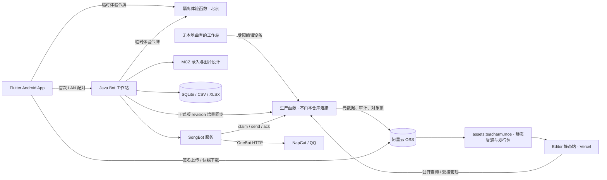

# Bot 工作站

一套面向音游社区运营的跨端机器人工作台。项目将 QQ 机器人、谱面制作、歌曲与 Stable 曲库、云公告、网站文章和移动管理整合到同一套系统中，同时保留原有高复杂度谱面参数和数据格式。

当前架构快照更新于 **2026-09-07**：面向国内用户的业务读写已迁移到北京地域云函数与 OSS/CDN，Vercel 主要承载 Editor 静态站及兼容部署。

> 本仓库是经过脱敏的作品集和**隔离体验版**分发渠道。这里下载的电脑端与 Android App 只连接独立的北京地域演示环境，使用演示数据和临时设备令牌；不会连接生产数据、公告、机器人中继或正式更新源。体验写权限最晚于 **2026-10-07 23:59:59（北京时间）** 到期，也可能由维护者提前关闭。Web 仍为只读展示。真实管理员凭据、群号、数据库、公告附件、歌曲音频、受许可限制的模板和签名密钥均不在仓库中。

## 下载隔离体验版

- [Windows 免安装客户端](https://github.com/Liccha/Bot-Workstation/releases/download/demo-v1.1.13-3/BotWorkstation-Demo-Windows.zip)：解压后运行 `BotWorkstationDemo.exe`。
- [Android App](https://github.com/Liccha/Bot-Workstation/releases/download/demo-v1.1.13-3/BotWorkstation-Demo-Android.apk)：使用独立应用 ID，可与正式版并存；首次启动自动领取临时体验令牌。

两端的歌曲与 Stable 修改只作用于共享的演示副本。维护者关闭体验写权限后，无需重新发布或卸载客户端。

## 项目亮点

- **一站式桌面工作台**：在 Java 桌面端统一管理 SongBot、NapCat、谱面工具、曲库、Stable 数据与运营入口。
- **跨端管理**：Flutter Android App 首次在局域网用一次性配对码注册可撤销设备账户，之后直接通过国内云数据 API 跨网络查询和修改歌曲/Stable 元数据，不依赖电脑在线。
- **秒级在线状态**：桌面端定期发布只含服务状态的轻量心跳，手机刷新不再投递远程命令；曲库统计异步更新，不阻塞在线检测。
- **运营开关持久化**：每日歌曲推送与竞猜可由工作站或手机端启停，默认关闭，重启后保持状态且不删除历史数据。
- **双形态数据访问**：主工作站保留 SQLite/CSV/XLSX 事务写入；没有本地曲库的安装可自动注册受限编辑设备，使用云快照和本机缓存直接工作。
- **低成本查询**：工作站按云 revision 增量回流数据；QQ群 `!ID/歌名/作者/谱师/别名` 查询始终命中本机 SQLite，不按消息请求云端资源。
- **国内云数据面**：阿里云函数计算 + OSS/CDN 承载歌曲、Stable、公告、附件、网站文章、移动设备和发布清单；支持签名上传、版本冲突检测、并发锁、任务认领、失败重试和审计记录。
- **纵深安全边界**：HttpOnly 管理员会话、HMAC 能力令牌、配对限速、请求体限制、路径校验与紧急写入阻断。
- **可发布交付**：Windows EXE/Setup、签名 Android APK、SHA-256 发布清单和启动前更新检查。

## 系统架构



更完整的数据流、并发模型和设计取舍见 [架构说明](docs/ARCHITECTURE.md)；权限边界见 [安全模型](docs/SECURITY_MODEL.md)。

## 仓库结构

| 目录 | 内容 |
| --- | --- |
| `mczmaker/` | 谱面录入、Combo/BPM、音频波形、封面与日历图设计 |
| `songbot/` | QQ 机器人、歌曲查询、Stable、公告执行与数据库服务 |
| `workstation/` | Java 桌面工作台、进程监管、云/本地双形态仓储、管理员能力门与首次配对 API |
| `mobile/` | Flutter Android 管理端 |
| `web/` | Editor 前端、通用 Node API、阿里云 FC 适配器、Vercel 兼容配置与 Node 测试 |
| `docs/` | 功能矩阵、设计系统、架构和安全说明 |

## 技术栈

- Java 11、Swing、FlatLaf、Maven
- SQLite、Apache POI、JFreeChart
- Flutter / Dart、Android SDK
- Node.js 20、阿里云函数计算、Vercel 静态托管/兼容函数
- 阿里云 OSS/CDN、NapCat / OneBot HTTP
- JUnit 5、Node Test Runner、Flutter Test、GitHub Actions

## 本地验证

### 1. Java 三模块

要求 JDK 21 和 Maven 3.9+；源码目标版本为 Java 11。

```bash
mvn -B -ntp clean verify
```

该命令会按 `mczmaker -> songbot -> workstation` 的依赖顺序编译，并执行 Catch 行块、公告版本、空数据保护、Unicode 附件名、Stable 事务和更新清单回归测试。

### 2. Web API

```bash
cd web
npm ci
npm test
```

`web/fc/` 仅保留架构实现供代码审阅；作品集网站策略会拒绝所有内容写请求。体验客户端使用单独部署、单独前缀和单独令牌的演示数据面。

### 3. Android App

```bash
cd mobile
flutter pub get
flutter analyze
flutter test test/widget_test.dart
```

首次配对仅接受私有局域网地址，桌面管理端口不会暴露到公网。配对完成后，App 保存短期体验令牌，此后只访问固定的隔离云数据接口。体验版不接收正式更新，体验结束后服务端会统一拒绝写入。Android 签名文件不属于源码，也不会进入 Git。

## 运行数据与素材

公开仓库不附带生产数据，也不会连接生产控制面。源码可用于审阅和测试；下载的体验客户端只操作独立的演示数据。架构中的完整正式系统依赖以下私有运行材料，这些内容不会发布：

1. 演示用 SQLite/CSV/XLSX 数据；
2. 自有或获得授权的歌曲、封面、字体及图片模板；
3. NapCat/OneBot 本机配置；
4. OSS、函数计算、Vercel 与管理员环境变量；
5. Android 或 Windows 发布签名。

`SONGBOT_DAILY_SONG_DIR` 可覆盖每日歌曲音频目录；未设置时回退到当前用户目录下的 `BotWorkstation/DailySongs`。

## 可靠性设计

- 本地数据库编辑使用事务，并原子更新 CSV 与 SQLite；云端编辑使用 revision、对象锁和幂等确认。
- 云端变更以增量事件回流主工作站；启动或同步失败时继续使用最后一份有效本地数据，不用空结果覆盖曲库。
- 云读取优先比较轻量 revision，版本未变直接复用缓存；分页 API 失败时回退到 gzip 快照，再回退到本机缓存。
- 图片和音频上传使用设备隔离的签名地址，服务端复核类型、大小、对象归属和歌曲 ID 后转入持久资源区；设备令牌不能取得 OSS AccessKey。
- Stable 保存前同时备份 XLSX 与 CSV，任何一步失败恢复旧文件。
- 公告保存使用 revision/CAS 语义，避免多人覆盖；发送使用带过期时间的 claim token，避免重复消费。
- 删除歌曲会释放 ID，并清理该 ID 所属的云端/本地图片与音频；公告与文章保留修订历史。关键云端写入受紧急锁控制，策略不可读取时按 fail-closed 处理。
- 自动更新清单校验 HTTPS 域名、路径、版本、大小和 SHA-256。

## 安全与隐私

请勿提交真实用户数据、群号、管理员白名单、密码、Token、AccessKey、数据库或签名文件。仓库内的编号都是演示值。提交前可运行：

```bash
node scripts/verify-public-tree.mjs
```

发现安全问题请参考 [SECURITY.md](SECURITY.md)，不要在公开 Issue 中附带凭据或真实数据。

## 隔离体验边界

- 这是生产项目的脱敏代码快照和临时体验客户端，不是生产环境备份或正式客户端。
- 电脑端与 App 只能连接固定的 `songbot-portfolio-demo` 服务；服务端再把所有对象限制在 `portfolio-demo/v1/` 前缀。即使下载者修改本地源码，也得不到生产令牌或生产写入口。
- 体验服务只开放歌曲与 Stable 演示数据读写；公告、网站管理、机器人中继、群控制和正式更新均不开放。作品集 Web 始终只读。
- 写权限由服务端总开关和到期时间共同控制，无需召回或重装客户端即可立即关闭。关闭后已安装客户端仍可展示已有数据，但修改请求返回“体验版修改权限已结束”。
- 正式用户的程序、云端配置和更新链路位于独立私有发布目录，不由本仓库构建或发布。
- 受许可限制的字体、图片模板、歌曲和附件未公开，因此部分设计/音频功能需要自行补充素材。
- CI 验证构建、核心数据不变量和 API 行为；真实 QQ、OSS 与 CDN 集成应在隔离的测试账号中做端到端验证。

## 文档

- [架构与数据流](docs/ARCHITECTURE.md)
- [功能完整性矩阵](docs/FEATURE_MATRIX.md)
- [管理员与移动端安全模型](docs/SECURITY_MODEL.md)
- [桌面设计系统](docs/DESIGN_SYSTEM.md)
