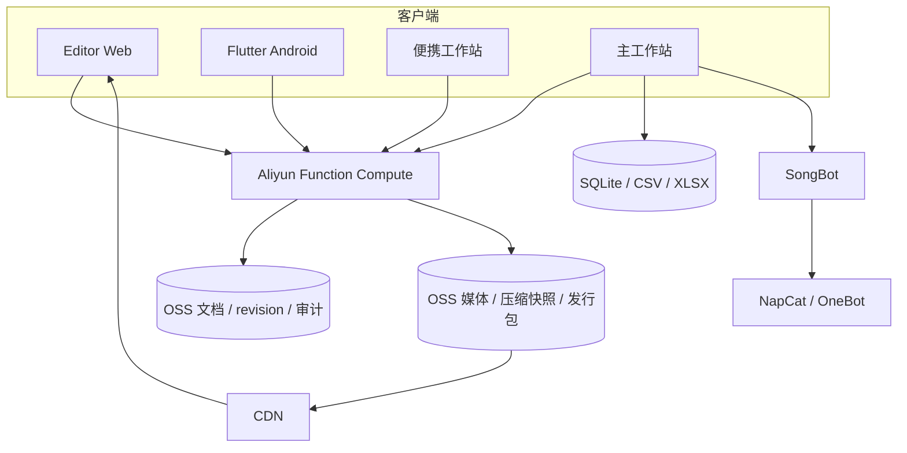
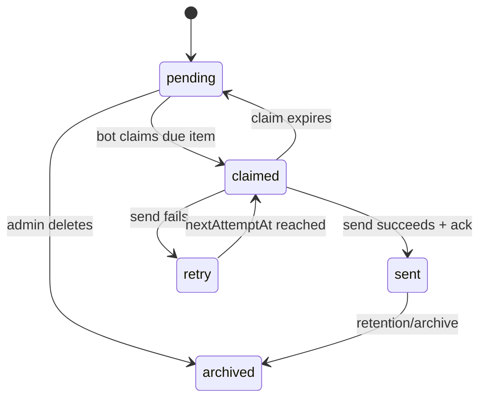

# 架构与关键设计

## 1. 边界划分

系统按“公开静态面、国内受控数据面、本机执行面”分为三层：

1. Editor 页面由 Vercel 托管，歌曲 JSON、图片、音频和安装包通过 CDN 缓存；
2. 北京地域阿里云函数计算是歌曲、Stable、公告、附件、网站文章及移动设备的主要 API 入口；
3. OSS 保存版本化文档、增量事件、审计、媒体对象和压缩快照；
4. NapCat 凭据、谱面源文件、音频处理和桌面进程控制只留在主工作站。

Vercel-compatible handler 与阿里云 FC adapter 共用业务实现，但国内客户端固定使用 FC 地址；这避免跨境函数访问北京 OSS 的高延迟，也避免为了远程管理而暴露 NapCat 或本机文件系统。

## 2. Java 模块

### MczMaker

负责谱面录入、BPM/Combo、音频试听与波形、封面裁剪、图片及日历模板。工作站通过适配层嵌入原组件，避免重写后破坏已有坐标和计算参数。

Catch 谱面使用独占键位块：即使只有一个难度，也保留完整 `0-0` 空位，防止普通谱面占用导致错行。

### SongBot

负责 OneBot 消息、歌曲/Stable 查询、每日歌曲、竞猜和公告执行。SQLite 使用 WAL；批量导入在确认新数据非空且格式有效后才替换旧表。

### Workstation

负责服务状态、进程监管、NapCat 端口配置、模块导航、管理员能力令牌和移动端首次配对 API。仓储层自动选择两种模式：

- 主工作站检测到本地 SQLite/XLSX 时，事务写本地数据并将变更同步到云端；
- 便携安装没有本地数据时，注册受限的 library-editor 设备，按 revision 读取分页/压缩快照，并把修改直接提交云端。

MCZ 新歌录入通过适配服务写同一云数据域，不再假设调用方拥有固定桌面路径。高复杂度业务仍由原模块完成，工作站只承担编排和边界控制。

## 3. 公告状态机

- `revision` 防止过期编辑覆盖新内容；
- 存储锁串行化当前文档更新；
- claim token 将“取任务”和“确认发送”关联起来；
- 附件在公告提交前校验对象键、大小和归属；
- 所有修改和发送动作写入审计事件。

## 4. 移动端协议

桌面端仅在用户主动启用后监听局域网端口，长期访问则切换到受限云数据 API：

1. App 先调用无敏感信息的 `/api/ping`；
2. 六位一次性配对码验证成功后，桌面端注册随机设备账户；服务端只保存令牌哈希，手机只获得一次明文令牌；
3. 配对尝试按来源 IP 限速；
4. 令牌保存在手机系统安全存储中；
5. 配对后可从任意网络使用歌曲与 Stable 白名单接口，电脑关闭不影响云端查询和修改；
6. 队列、结果与上传暂存对象按设备隔离，设备可单独撤销，紧急锁阻断全部写入；
7. 普通移动令牌不能构造公告管理员页面或换取云端管理员权限。

歌曲和 Stable 的云端数据操作不依赖电脑在线。SongBot/NapCat 启停属于本机进程操作，只能在主机后台代理在线时通过白名单中继执行；桌面代理采用出站轮询和轻量心跳，本机不开放公网入站端口。

## 5. 曲库同步与缓存

1. 云端每次写入生成单调递增 revision 和可重放变更事件；
2. 主工作站只拉取上次游标后的变更，原子更新 CSV/SQLite，再发布公开曲库与媒体；
3. SongBot 的群聊查询始终访问本机 SQLite，匹配 ID、歌名、作者、谱师和别名；
4. Web/App/便携工作站先比较小型状态标记，版本未变复用缓存；
5. 分页接口异常时下载经过大小和来源校验的 gzip 快照，仍失败才使用最后一份本机缓存；
6. 图片/音频先取得设备隔离的签名上传地址，完成后由服务端移动到 `歌曲 ID` 专属路径并写入不可伪造的对象引用。

这样既允许外部设备录入最新 ID，又不会让每条群消息触发 OSS 请求或反复下载完整曲库。

## 6. 更新链路

PC 与 Android 使用独立版本清单。上传流程先发布带内容哈希的不可变二进制，再原子更新 `latest.json`，避免客户端看到尚不存在的新包。Android App 在应用内流式下载更新包并显示进度，验证 HTTPS 来源、允许的路径、文件大小和 SHA-256 后才调用系统安装器。歌曲、Stable、公告及静态资源属于云数据更新，不要求重新安装 App；Android 可执行代码升级仍由系统确认安装。

## 7. 主要权衡

- **选择 Swing 而非重写为 Web/Electron**：可以直接复用成熟的 Java 谱面、音频和图片组件，降低功能回归风险。
- **首次配对采用 LAN，长期管理采用白名单云 API**：本机端口不暴露公网，同时允许已登记设备在电脑离线时跨网络维护运营数据。
- **高频群查询保持本地**：CSV 在启动阶段导入 SQLite，QQ群的每次 `!` 查询只访问本机数据库；云端只承载低频管理与静态资源，避免按群消息查询产生费用。
- **云编辑增量回流机器人**：后台按 revision 读取变更事件，只有数据变化时才更新本地库和公开快照；失败时继续使用上一份有效数据。
- **FC 为国内主入口，Vercel 保留静态站和兼容面**：前端部署与数据处理解耦，减少国内写入超时，同时保留同一 handler 的可移植性。
- **便携端云模式而非捆绑生产数据库**：公开安装包不携带真实曲库；设备只获得受限编辑令牌和缓存，不能取得 OSS AccessKey、桌面令牌或管理员能力。
- **兼容旧数据而非一次性迁移格式**：保留现有 ID、Excel 列和模板坐标，写入侧增加校验、备份与回滚。
