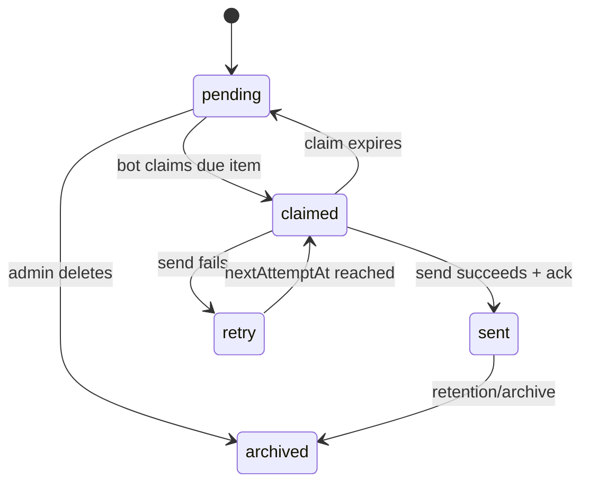

# 架构与关键设计

## 1. 边界划分

系统按“公开读取、受控写入、本机高权限操作”分为三层：

1. Editor 静态页面和公开歌曲查询可经 CDN 访问；
2. 公告、附件、网站文章等写操作必须经过云 API 的服务端鉴权；
3. NapCat 凭据、谱面文件、音频处理和桌面进程控制只留在本机。

这种划分避免为了远程管理而将 NapCat 或本机文件系统直接暴露到公网。

## 2. Java 模块

### MczMaker

负责谱面录入、BPM/Combo、音频试听与波形、封面裁剪、图片及日历模板。工作站通过适配层嵌入原组件，避免重写后破坏已有坐标和计算参数。

Catch 谱面使用独占键位块：即使只有一个难度，也保留完整 `0-0` 空位，防止普通谱面占用导致错行。

### SongBot

负责 OneBot 消息、歌曲/Stable 查询、每日歌曲、竞猜和公告执行。SQLite 使用 WAL；批量导入在确认新数据非空且格式有效后才替换旧表。

### Workstation

负责服务状态、进程监管、NapCat 端口配置、模块导航、管理员能力令牌和移动端局域网 API。高复杂度业务仍由原模块完成，工作站只承担编排和边界控制。

## 3. 公告状态机

- `revision` 防止过期编辑覆盖新内容；
- 存储锁串行化当前文档更新；
- claim token 将“取任务”和“确认发送”关联起来；
- 附件在公告提交前校验对象键、大小和归属；
- 所有修改和发送动作写入审计事件。

## 4. 移动端协议

桌面端仅在用户主动启用后监听局域网端口：

1. App 先调用无敏感信息的 `/api/ping`；
2. 六位一次性配对码换取带有效期的 HMAC 令牌；
3. 配对尝试按来源 IP 限速；
4. 令牌保存在手机系统安全存储中；
5. 普通移动令牌不能构造公告管理员页面或换取云端管理员权限。

## 5. 更新链路

PC 与 Android 使用独立版本清单。上传流程先发布带内容哈希的不可变二进制，再原子更新 `latest.json`，避免客户端看到尚不存在的新包。客户端验证 HTTPS 来源、允许的路径、文件大小和 SHA-256 后才进入安装流程。

## 6. 主要权衡

- **选择 Swing 而非重写为 Web/Electron**：可以直接复用成熟的 Java 谱面、音频和图片组件，降低功能回归风险。
- **移动端采用 LAN 而非公网控制**：牺牲跨网络便利性，换取更小的高权限攻击面。
- **云端仅保存运营数据**：公告稳定性不再依赖本机在线，同时本机令牌和媒体处理保持隔离。
- **兼容旧数据而非一次性迁移格式**：保留现有 ID、Excel 列和模板坐标，写入侧增加校验、备份与回滚。
